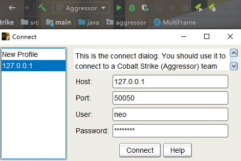

# CobaltStrike source code

CobaltStrike's source code,tested some code and function

Thanks to [cs](https://www.cobaltstrike.com/), [jetbrains](https://www.jetbrains.com/?from=https://github.com/Freakboy/CobaltStrike)

This src code could be run in IDEA,depends jdk8+,gradle 5.x

Not a simple reverse code, make sure that the code and functions are working done, build pass and tested

Restore the framework searched by the target as much as possible during development

This code is only for research and learning, if there is any infringement, it will be deleted immediately
